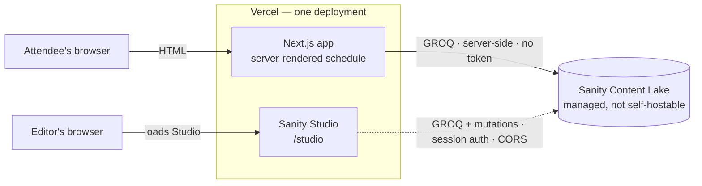

# Architecture

> **Outline.** Sections are written as the corresponding work lands, so that this document
> describes the system that exists rather than the one that was intended. Empty sections are
> listed deliberately — a gap here means the work has not been done, not that it was forgotten.

## System shape

Three parts:

- **The Next.js application** — will serve the public schedule, rendered on the server, deployed to
  Vercel. It currently serves an empty page; the schedule arrives in Milestone 4.
- **Sanity Studio** — the editorial interface, served by that same application at `/studio`.
  Running, with an empty schema. See
  [ADR-0001](./decisions/0001-embed-sanity-studio-in-the-next-application.md).
- **Sanity's Content Lake** — where content lives. A managed service with no self-hosted
  equivalent; the Studio and the application are both clients of it.

**Intended once content exists:** the application reads on the server, so a visitor's browser never
talks to the Content Lake. The Studio, running in the editor's browser, does — which is why its
origin must be registered for CORS while the public site needs no such registration. The CORS
asymmetry is already real and already verified; the server-side reading is not yet implemented.



The dashed edge is the only one that leaves a browser, and it is the reason CORS exists in this
system at all. Note what the diagram does **not** show: any path from an attendee's browser to the
Content Lake. That absence is the design.

### The Studio's client boundary

The Studio is rendered through an explicit `"use client"` boundary
(`src/app/studio/[[...tool]]/Studio.tsx`) rather than directly from the route's page component.
This is not stylistic.

Importing `sanity.config.ts` from a Server Component pulls the entire `sanity` package into the
React Server Components graph. Under the `react-server` export condition, some of its dependencies
resolve to server-only builds — `swr` exports no default there, which Sanity's validation
utilities import as one — and the route fails to compile:

```text
Export default doesn't exist in target module
  import useSWR from "swr";
```

Moving the config import behind a client boundary keeps the Studio's module graph in the client
layer, where it belongs. The Studio is a client application; the boundary is drawn where the truth
already was.

### Environment

All environment access goes through `src/lib/env.ts`, which validates on read and fails with a
message naming the missing variable. `sanity.cli.ts` is the single deliberate exception: the CLI
runs in plain Node without Next.js module resolution, and a missing value there breaks a
developer's command rather than a visitor's request.

## Content model

Four documents and two objects.

```mermaid
erDiagram
    EVENT ||--o{ SESSION : "bounds the dates of"
    TRACK ||--o{ SESSION : "hosts"
    SESSION }o--o{ SPEAKER : "is presented by"
    SESSION ||--o| LIVE_STATUS : "embeds"
    SPEAKER ||--o{ LINK : "embeds"
    TRACK ||--o{ LIVE_STATUS : "is moved-to by"

    EVENT {
        string name
        date startDate
        date endDate
        string timezone "IANA, venue"
    }
    TRACK {
        string name
        slug slug "URL filter"
        number order "grid column"
    }
    SESSION {
        string title
        slug slug
        string type "talk|workshop|break|…"
        datetime startsAt "UTC instant"
        number durationMinutes "end is derived"
    }
    SPEAKER {
        string name
        slug slug
        image photo
        blocks bio
    }
    LIVE_STATUS {
        string state "onTime|delayed|moved|cancelled"
        number delayMinutes
        string note
    }
    LINK {
        string label
        url href
    }
```



`EVENT`, `TRACK`, `SESSION` and `SPEAKER` are documents. `LIVE_STATUS` and `LINK` are objects,
drawn here because their fields matter, but they have no independent existence.

**One edge is not a stored reference.** `EVENT → SESSION` is drawn because the relationship is
real — the event's date range and timezone determine which day a session falls on, and validation
rejects sessions outside it — but no field holds it. The event is a singleton, so the association
is implicit rather than persisted. Every other edge in the diagram is a reference you can follow
in the data.

### Why each is a document or an object

The distinction is not stylistic. A **document** has an identity, a lifecycle, and things that
refer to it. An **object** is part of whatever contains it and has none of those.

- **Track** is a document because a room is renamed and reordered independently of the thirty
  sessions in it. Storing the room as a string on each session would make a rename an edit of
  thirty documents.
- **Speaker** is a document because one person appears in several sessions and their biography
  should be written once. Embedding it would duplicate the content and let the copies drift.
- **Live status** is an object because it has no meaning apart from the session it describes, is
  never referenced, and is only ever read alongside it. As a document it would add a reference to
  resolve on the hottest read in the system.

### Relationships

Session→speaker is **many-to-many** and needs no join document: the relationship carries no
attributes of its own, and the ordered reference array on the session holds everything — including
credit order, which the array position already expresses. This is where a conference differs from,
say, a festival, whose performance of an artist in a room at a time is itself an entity.

Session→track is a single required reference. The `movedToTrack` reference inside `liveStatus` is
the second edge from a session into a track, and it is why a track cannot be deleted casually once
an event is running.

### Time, and the absence of a Day

Sessions store a UTC instant plus a duration; end times are derived. Conference days are computed
from the event's date range rather than modelled. Both decisions, with the alternatives that were
rejected, are in [ADR-0002](./decisions/0002-store-a-start-instant-and-a-duration.md).

One consequence is worth repeating here because it is easy to get wrong: **grouping sessions into
days requires converting each instant into the venue timezone first.** A session at 23:30 venue
time falls on a different date in UTC, so a grouping that compares raw timestamps is wrong for
late sessions — quietly, and only sometimes.

## Validation

_To be written in Milestone 2._ Which rules block publishing and which only advise, and the
reasoning behind that split. Where scheduling logic lives, and why it is expressed as pure
functions rather than inside the schema.

## Data access

_To be written in Milestone 4._ The boundary around Sanity, the typed query layer, the single
fetching helper, and how generated types flow from the schema to the components.

## Rendering and component boundaries

_To be written in Milestone 4._ What renders on the server, the two Client Components and the
reason each one cannot be a Server Component, and how filtering works without client state.

## Timezones

_To be written in Milestone 4._ Where time is stored, where it is converted, the hydration hazard
created by rendering a viewer's local time, and how it is contained.

## Caching and invalidation

_To be written in Milestone 5._ Cache tags, their lifetimes, the webhook that invalidates them,
and what happens when a webhook is never delivered.

## Editorial workflow

_To be written in Milestone 5._ The two Studio panes, the publish-in-one-step document action, and
draft mode.

## Accessibility

_To be written in Milestone 6._ How the timetable reconciles a visual grid with a linear reading
order, and how live changes are announced.

## Performance

_To be written in Milestone 6._ The budget, the measured result, and where the risks were.

## Hosting, plans, and portability

_To be written in Milestone 7._ What is hosted where, the constraints of the Sanity plan in use,
what is portable off this stack, and what is not.
