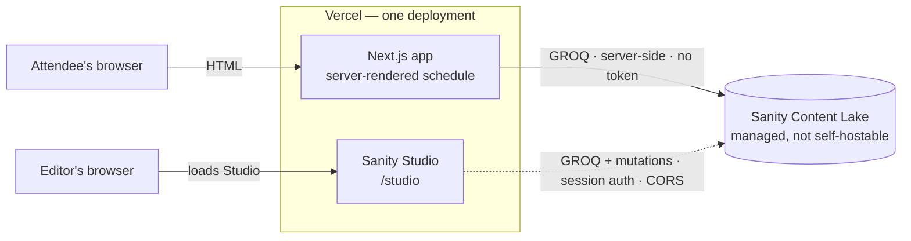
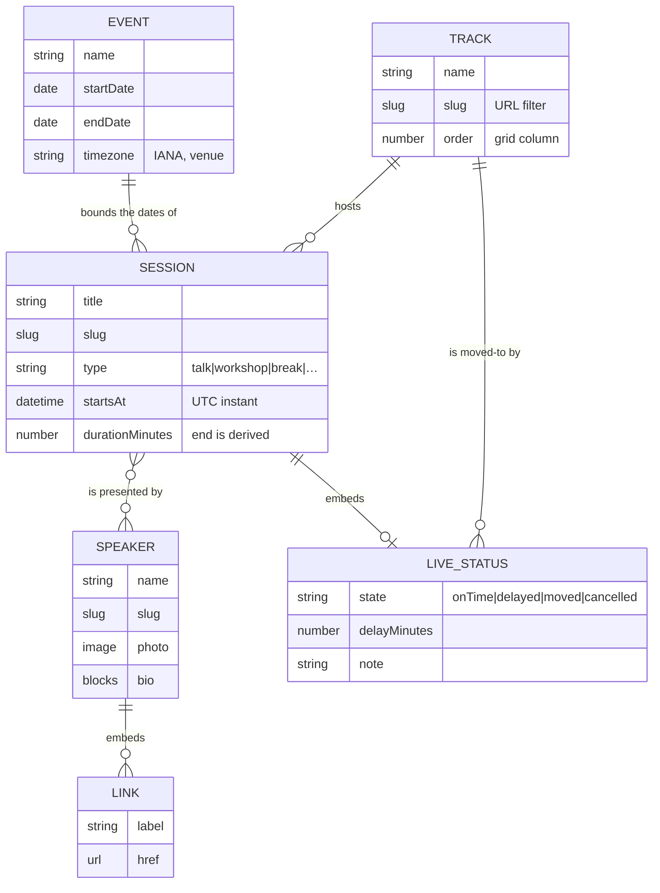
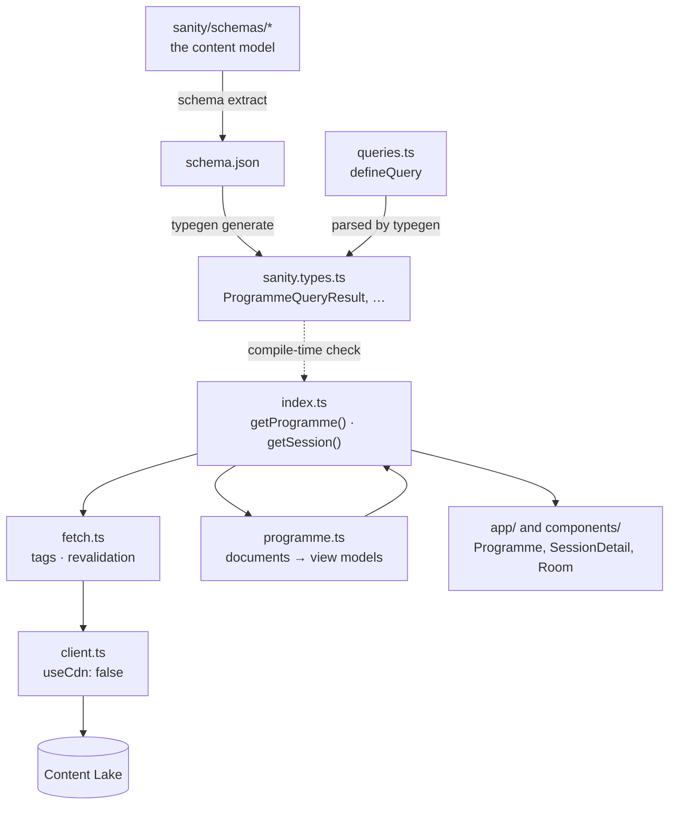

# Architecture

> **Outline.** Sections are written as the corresponding work lands, so that this document
> describes the system that exists rather than the one that was intended. Empty sections are
> listed deliberately — a gap here means the work has not been done, not that it was forgotten.

## System shape

Three parts:

- **The Next.js application** — serves the public schedule, rendered on the server.
- **Sanity Studio** — the editorial interface, served by that same application at `/studio`. See
  [ADR-0001](./decisions/0001-embed-sanity-studio-in-the-next-application.md).
- **Sanity's Content Lake** — where content lives. A managed service with no self-hosted
  equivalent; the Studio and the application are both clients of it.

The application reads on the server, so a visitor's browser never talks to the Content Lake. The
Studio, running in the editor's browser, does — which is why its origin must be registered for
CORS while the public site needs no such registration.



The dashed edge is the only one that leaves a browser, and it is the reason CORS exists in this
system at all. Note what the diagram does **not** show: any path from an attendee's browser to the
Content Lake. That absence is the design.

### The Studio's client boundary

The Studio is rendered through an explicit `"use client"` boundary
(`src/app/studio/[[...tool]]/Studio.tsx`) rather than directly from the route's page component.
This is not stylistic.

Importing `sanity.config.ts` from a Server Component pulls the entire `sanity` package into the
React Server Components graph. Under the `react-server` export condition, some of its dependencies
resolve to server-only builds — `swr` exports no default there, which Sanity's validation
utilities import as one — and the route fails to compile:

```text
Export default doesn't exist in target module
  import useSWR from "swr";
```

Moving the config import behind a client boundary keeps the Studio's module graph in the client
layer, where it belongs. The Studio is a client application; the boundary is drawn where the truth
already was.

### Environment

All environment access goes through `src/lib/env.ts`, which validates on read and fails with a
message naming the missing variable. `sanity.cli.ts` is the single deliberate exception: the CLI
runs in plain Node without Next.js module resolution, and a missing value there breaks a
developer's command rather than a visitor's request.

## Content model

Four documents and two objects.



`EVENT`, `TRACK`, `SESSION` and `SPEAKER` are documents. `LIVE_STATUS` and `LINK` are objects,
drawn here because their fields matter, but they have no independent existence.

**One edge is not a stored reference.** `EVENT → SESSION` is drawn because the relationship is
real — the event's date range and timezone determine which day a session falls on, and validation
rejects sessions outside it — but no field holds it. The event is a singleton, so the association
is implicit rather than persisted. Every other edge in the diagram is a reference you can follow
in the data.

### Why each is a document or an object

The distinction is not stylistic. A **document** has an identity, a lifecycle, and things that
refer to it. An **object** is part of whatever contains it and has none of those.

- **Track** is a document because a room is renamed and reordered independently of the thirty
  sessions in it. Storing the room as a string on each session would make a rename an edit of
  thirty documents.
- **Speaker** is a document because one person appears in several sessions and their biography
  should be written once. Embedding it would duplicate the content and let the copies drift.
- **Live status** is an object because it has no meaning apart from the session it describes, is
  never referenced, and is only ever read alongside it. As a document it would add a reference to
  resolve on the hottest read in the system.

### Relationships

Session→speaker is **many-to-many** and needs no join document: the relationship carries no
attributes of its own, and the ordered reference array on the session holds everything — including
credit order, which the array position already expresses. This is where a conference differs from,
say, a festival, whose performance of an artist in a room at a time is itself an entity.

Session→track is a single required reference. The `movedToTrack` reference inside `liveStatus` is
the second edge from a session into a track, and it is why a track cannot be deleted casually once
an event is running.

### Time, and the absence of a Day

Sessions store a UTC instant plus a duration; end times are derived. Conference days are computed
from the event's date range rather than modelled. Both decisions, with the alternatives that were
rejected, are in [ADR-0002](./decisions/0002-store-a-start-instant-and-a-duration.md).

One consequence is worth repeating here because it is easy to get wrong: **grouping sessions into
days requires converting each instant into the venue timezone first.** A session at 23:30 venue
time falls on a different date in UTC, so a grouping that compares raw timestamps is wrong for
late sessions — quietly, and only sometimes.

## Validation

Rules are split by **whether the described programme could exist**, not by how much the problem
matters. Errors block publishing; warnings never do. The reasoning, and the three alternatives
rejected, are in [ADR-0003](./decisions/0003-split-validation-by-severity.md).

| | Blocks publishing | Examples |
| --- | --- | --- |
| **Error** | Yes | Two sessions in one room at once · session outside the conference dates · workshop with no capacity or sign-up URL · a delay with no minutes · missing room, start or duration |
| **Warning** | No | A speaker double-booked · no speakers yet · missing portrait, biography or abstract |

The test for a new rule is one question: if this were published as it stands, would the schedule be
**wrong**, or merely **incomplete**?

### Where the logic lives

```
sanity/lib/scheduling.ts   pure functions -- no Sanity, no network, no clock
sanity/lib/validation.ts   fetches candidates, turns answers into messages
sanity/schemas/…           declares which rule is an error and which a warning
```

The separation exists so that the rules can be tested. `scheduling.ts` imports nothing and has 47
unit tests; `validation.ts` is a thin layer that is exercised by using the Studio. Overlap
detection, day derivation and the event-bounds check are all decided in the pure layer — the
schema only decides severity.

**Overlap cannot be expressed as a GROQ filter**, because the end of a session is derived rather
than stored ([ADR-0002](./decisions/0002-store-a-start-instant-and-a-duration.md)). Candidates are
narrowed by room in the query and compared in memory. For tens of sessions per room that is the
right trade; at thousands the fix would be a denormalised end time, not a weaker rule.

**Rules are attached to fields, never to the document.** A document-level rule appears only in the
validation panel, and the Publish button reduces it to a generic sentence. Attaching each rule to
the field it concerns puts the message where the editor is already looking.

Two further details that are easy to get wrong:

- **Back-to-back sessions are not conflicts.** Intervals are half-open, so a talk ending at 10:30
  and one starting at 10:30 coexist. Flagging the ordinary case would teach editors to ignore the
  rule.
- **A document and its own draft are the same session.** Both ids are excluded from the conflict
  query, and remaining candidates are deduplicated by published id — otherwise every session with
  an unpublished edit in flight would appear to collide with itself.

## Data access

**Nothing outside `src/lib/sanity/` imports the Sanity client, writes GROQ, or handles a Sanity
document.** Routes call four functions and receive types defined in this repository. The reasoning
and the costs are in
[ADR-0006](./decisions/0006-confine-sanity-access-to-one-directory.md).



The dotted edge is what makes `pnpm schema:check` mean something. `index.ts` fetches as
`ProgrammeQueryResult` and hands that value straight to a mapping function which declares its own
input shape — so removing a field from the schema stops the application compiling, rather than
producing `undefined` at runtime.

Those two type sets are deliberately not the same. Typegen describes what the Studio *will write*;
the mapper's input types are wider, because **the Content Lake is schemaless** and a document
created while an option existed still holds that value after the option is removed. Typegen checks
the queries; the runtime guards handle what may actually arrive.

### The mapping layer, and the one rule it exists to enforce

`programme.ts` converts documents into `Programme`, `Day`, `ScheduledSession`, `Room` and
`Speaker`. Two things happen there that could not safely happen anywhere else.

**The `liveStatus` contract.** That object hides fields by state rather than clearing them — see
its docstring — so a session marked delayed by twenty minutes and then set back to on time still
carries `delayMinutes: 20`. `toStatus` drops `delayMinutes` unless the state is `delayed` and
`movedTo` unless it is `moved`. Enforcing this at every call site would mean trusting every call
site.

**Planned against effective.** A delayed session's `startsAt` has the delay applied and its
`plannedStartsAt` does not; a moved session's `room` is the new one and `plannedRoom` the old. So
components render "14:10 (was 13:50)" without knowing any status rules, and the grid places a
moved session in the right column for free. A cancelled session keeps its planned slot, because
somebody looking for it is looking where the printed programme put it.

Both are unit-tested, which is only possible because the layer is pure.

### Caching policy

Expressed once, in `fetch.ts`. Two things are being decided, and they are not the same thing —
**tags decide what an invalidation reaches; intervals belong to a read.**

The tags are named after what changes rather than after what is displayed:

| Tag | Covers |
| --- | --- |
| `programme` | Which sessions exist, when they were planned, who speaks, the rooms |
| `status` | Live status only, the volatile half |

The intervals are per read, because a request carries one:

| Read | Tags | Interval |
| --- | --- | --- |
| `getProgramme` | `programme`, `status` | 1 minute |
| `getSession` | `programme`, `status` | 1 minute |
| `getSessionSlugs` | `programme` | 1 hour |

The first two fetch structure and status together, in one round trip, so they take the shorter of
the two lifetimes — a response is only as fresh as its most volatile part. `getSessionSlugs`
answers which pages exist, which is a structural question and nothing to do with the event
running, so it takes the hour.

Splitting the schedule into two requests to give each half its own interval would mean two round
trips to render one page, and the shorter interval already bounds the staleness of the whole.
That is the trade, and it is the reason the volatility split shows up in the *tags* rather than in
the intervals: when the webhook lands in Milestone 5, a biography edit will invalidate `programme`
without touching a page that only needed `status`, which is where the separation actually pays.

The argument in one sentence: a speaker's biography and a session's live status appear on the same
page and cannot share a lifetime. The intervals are a floor under correctness, not the freshness
mechanism — tag invalidation is — and they bound how long a *missed* invalidation can go
unnoticed.

`client.ts` sets `useCdn: false`, which is the counterintuitive part. Sanity's CDN and Next's Data
Cache are both caches, and stacking them means an invalidation reaches only the outer one: Next
re-runs the query, the CDN answers from a stale edge copy, and the page updates to the same wrong
content with nothing in the logs to say so. Next owns caching here.

## Rendering and component boundaries

Everything is a Server Component except two, and the exceptions are not stylistic — each needs
something a server does not have.

| Component | What it needs | Why the server cannot supply it |
| --- | --- | --- |
| `LocalTime` / `LocalZoneLabel` / `ViewerTimeNote` | The reader's timezone | It is not in any request header |
| `NowMarker` | A clock that keeps running | The server rendered the page once, possibly a minute ago |
| `BackToProgramme` | The current query string on a statically rendered page | Reading it on the server would make all 26 session pages dynamic |

Filtering by day and room is **not** client state. Each filter is a `<Link>` to a different URL,
resolved on the server. That makes a filtered view shareable and bookmarkable, makes the back
button behave, and costs no JavaScript at all — which matters most on the one page that has to
work on venue wifi before a bundle arrives.

The filters are deliberately not ARIA tabs. A tablist promises panels that are already present and
arrow keys that move between them; each of these is a navigation. `aria-current` conveys the fact
that actually needs conveying.

### Routes

| Route | Rendering | Notes |
| --- | --- | --- |
| `/` | Dynamic | Reads `searchParams` for day, room and timezone. Data is cached; the render is per request. Lives in the `(schedule)` route group. |
| `/sessions/[slug]` | Static (SSG) | `generateStaticParams` prerenders one page per published session; `dynamicParams` stays `true`, so a session published later renders on demand. |
| `/studio/[[...tool]]` | Static shell | The Studio itself is a client application. |

The detail route stays static because it does not read `searchParams` at all. It would have had to,
to carry the timezone preference — so instead it shows venue time and the reader's own time
together, and isolates the one thing that genuinely needs the URL (the back link's timezone
parameter) behind a Suspense boundary.

The loading skeleton lives at `src/app/(schedule)/loading.tsx`, not at the application root, and the
`(schedule)` route group exists for exactly that reason. A root-level `loading.tsx` places a
Suspense boundary around every route beneath it, `/sessions/[slug]` included. Next flushes `200`
response headers to stream that fallback before the session page's `getSession()` resolves, so a
later `notFound()` cannot set a 404 — the status is locked once streaming starts. An unknown slug
then returned a soft 404: the not-found UI under a `200`. Scoping the boundary to the schedule
alone means the session route streams nothing before its `notFound()`, so an unknown slug is a true
404. See [ADR-0007](./decisions/0007-scope-the-loading-skeleton-with-a-route-group.md). Verified
under `next start`, since a soft 404 does not reproduce in dev.

### The timetable's markup

One ordered list per day, in chronological order, with inline `grid-row` and `grid-column` on each
item; `display: grid` above `lg` and `display: flex` below it. No markup is rendered twice.
[ADR-0005](./decisions/0005-render-the-timetable-as-one-chronological-list.md) records why, and
what it costs — chiefly that the room headers are `aria-hidden` decoration, so every card carries
its room name in the accessibility tree.

## Timezones

Four places, and they do different things:

1. **Storage.** `startsAt` is a UTC instant. Sanity stores datetimes exactly as written, so the
   fixtures normalise to `Z` and a test enforces it — an offset form and a `Z` form in one dataset
   compare wrongly under GROQ's lexicographic string comparison.
2. **Grouping into days.** Each instant is converted to the **venue's** date before grouping. A
   session at 23:30 in Buenos Aires is already tomorrow in UTC, so grouping on raw timestamps files
   late sessions under the wrong day — quietly, and only sometimes.
3. **Grid placement.** `layOutDay` works in *minutes since local midnight at the venue*, not in
   UTC offsets. A grid derived from UTC lines up only where the venue's offset is a whole number of
   hours, and is half an hour out in Kolkata or Adelaide. Tested.
4. **Display.** Venue time by default, everywhere, because a conference is spoken in venue time all
   day — signage, announcements, the person next to you.

### The viewer's own time, and the hydration hazard

The browser's timezone is unknowable on the server, so rendering it is a hydration hazard by
construction: the server says `10:45`, the client wants `15:45`, and React either warns or silently
keeps whichever it saw first.

It is contained with `useSyncExternalStore` rather than state set from an effect. The **server
snapshot** is the venue time already in the HTML, and React uses it for the hydrating render; the
**client snapshot** is the reader's own, read immediately afterwards. So the first client render is
byte-identical to the HTML, and the swap is a second render rather than a correction of a
mismatched one.

Zero layout shift falls out of the format rather than from a fixed width: both strings are 24-hour
and zero-padded, so both are five characters, and `font-variant-numeric: tabular-nums` in the
global stylesheet makes those five characters the same width whatever the digits are.

Without JavaScript the page shows venue time, correctly labelled as venue time. That is the
degraded state and it is a correct one.

The axis re-expresses itself too, which is why `layOutDay` returns an *instant* per hour mark
rather than an hour: only an instant can be restated in another zone. That instant is derived from
a session in the same day rather than reconstructed from the date and the zone, because converting
local wall time back to an instant is the one direction `Intl` does not offer. The arithmetic is
exact except across a DST transition falling inside a conference day, which is recorded in the
code rather than hidden.

## Caching and invalidation

_To be written in Milestone 5._ Cache tags, their lifetimes, the webhook that invalidates them,
and what happens when a webhook is never delivered.

## Editorial workflow

_To be written in Milestone 5._ The two Studio panes, the publish-in-one-step document action, and
draft mode.

## Accessibility

_To be written in Milestone 6._ How the timetable reconciles a visual grid with a linear reading
order, and how live changes are announced.

## Performance

_To be written in Milestone 6._ The budget, the measured result, and where the risks were.

## Hosting, plans, and portability

_To be written in Milestone 7._ What is hosted where, the constraints of the Sanity plan in use,
what is portable off this stack, and what is not.
